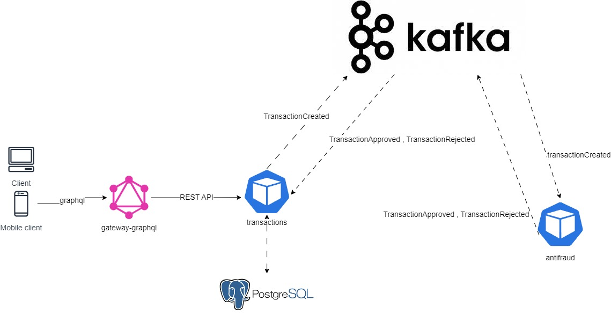

# Yape Code Challenge :rocket:
[The solution is in the end](#SolutionChallenge)

Our code challenge will let you marvel us with your Jedi coding skills :smile:. 

Don't forget that the proper way to submit your work is to fork the repo and create a PR :wink: ... have fun !!

- [Problem](#problem)
- [Tech Stack](#tech_stack)
- [Send us your challenge](#send_us_your_challenge)

# Problem

Every time a financial transaction is created it must be validated by our anti-fraud microservice and then the same service sends a message back to update the transaction status.
For now, we have only three transaction statuses:

<ol>
  <li>pending</li>
  <li>approved</li>
  <li>rejected</li>  
</ol>

Every transaction with a value greater than 1000 should be rejected.

```mermaid
  flowchart LR
    Transaction -- Save Transaction with pending Status --> transactionDatabase[(Database)]
    Transaction --Send transaction Created event--> Anti-Fraud
    Anti-Fraud -- Send transaction Status Approved event--> Transaction
    Anti-Fraud -- Send transaction Status Rejected event--> Transaction
    Transaction -- Update transaction Status event--> transactionDatabase[(Database)]
```

# Tech Stack

<ol>
  <li>Node. You can use any framework you want (i.e. Nestjs with an ORM like TypeOrm or Prisma) </li>
  <li>Any database</li>
  <li>Kafka</li>    
</ol>

We do provide a `Dockerfile` to help you get started with a dev environment.

You must have two resources:

1. Resource to create a transaction that must containt:

```json
{
  "accountExternalIdDebit": "Guid",
  "accountExternalIdCredit": "Guid",
  "tranferTypeId": 1,
  "value": 120
}
```

2. Resource to retrieve a transaction

```json
{
  "transactionExternalId": "Guid",
  "transactionType": {
    "name": ""
  },
  "transactionStatus": {
    "name": ""
  },
  "value": 120,
  "createdAt": "Date"
}
```

## Optional

You can use any approach to store transaction data but you should consider that we may deal with high volume scenarios where we have a huge amount of writes and reads for the same data at the same time. How would you tackle this requirement?

You can use Graphql;

# Send us your challenge

When you finish your challenge, after forking a repository, you **must** open a pull request to our repository. There are no limitations to the implementation, you can follow the programming paradigm, modularization, and style that you feel is the most appropriate solution.

If you have any questions, please let us know.

# SolutionChallenge

Resolved  By: Gustavo Condezo

Email: gustavocondezocamayo@gmail.com

Linkedin: https://www.linkedin.com/in/gustavo-condezo-camayo-52ab3b196/

### Diagram


### Components
The solution consist of:
* **gateway-graphql:**
    Micro with Nestjs and Graphql

* **shared-libreary-challenge:**
  Shared event library, code, published on npm
* **transaction:**
    This micro is called internally by micro gateway-graphql. Does not expose apis outside the 'cluster'
    Microservice made with nestjs, typeorm con transacciones, Kafka
    * This micro Exposes two APIs http://localhost:3000/transaction (internal docker). Apis documentated with postman in ./transactions/api-transaction.postman_collection.json
        * POST /transaction :To create a transaction (Store in postgres using sql transac) and emit event to kafka on 'transationCreated' topic
        * GET /transaction/{uuid_transaction} : Gets by previously created Id
    
    * It service is subscribed to two Kafka topics:
        * transactionApproved : Receives the approved transaction id and saves in BD
        * transactionRejected : Receives the rejected transaction id and saves to BD

* **antifraud**: It is a microservice made with NestJs y kafka

    * This micro is subscribed to a kafka topic:
        * transactionCreated: Receives a transaction and according to logic approves or rejects a transaction, then emits an event, 'transactionApproved' or 'transactionRejected' respectively.


### 1. Run docker compose with postgress and kafka and services
   will automatically run a script (script.sql) to create the db and populate data in postgres and run services. **Wait some minutes**
````shell
docker-compose up
````
wait for kafka, postgres and services to initialize successfully. **Wait some 7 minutes**

If you see error messages consider stopping and restarting docker-compose.

**wait for this message confirmation when is run successfull:**


### View in graphql

In your host machine open in navigator this url: http://localhost:3001/graphql

Run querys GraphQl

* Create transaction:
    This create transaction and return field transactionExternalId

````text
mutation {
  createTransaction(
    createTransactionInput: {
      accountExternalIdDebit: "9035832f-5590-4e93-b13e-0f68b81217a7"
      accountExternalIdCredit: "4f60f1ad-9f4d-4448-8e7c-bb363f9e345f"
      transactionTypeId: 1
      value: 55
    }
  ) {
    transactionExternalId
    transactionType{
      name
    }
    transactionStatus{
    	name
    }
    value
    createdAt  }
}
````

* Consult Transaction by transactionExternalId

    in the transactionExternalId parameter replace the previous response that you received when creating a transaction
````text
query {
  findOne(transactionExternalId:  "475a2909-d40b-4bba-a02f-f1ff5ff6985b") {
    transactionExternalId
    transactionType{
      name
    }
    transactionStatus{
    	name
    }
    value
    createdAt
  }
}
````

## Pruebas E2E
Each micro comes with e2e tests. An in-memory Postgres DB is used.
Inside each folder of each micro run
````shell
npm run test:e2e
````
